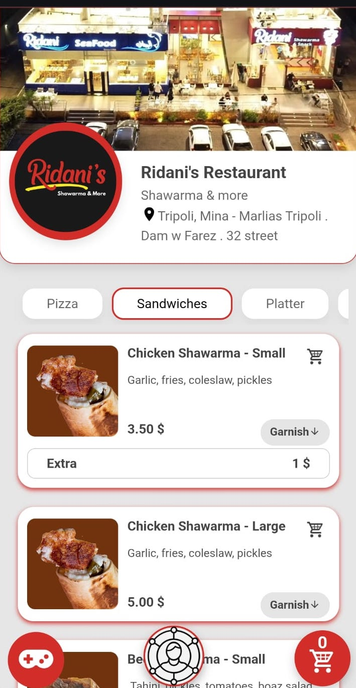
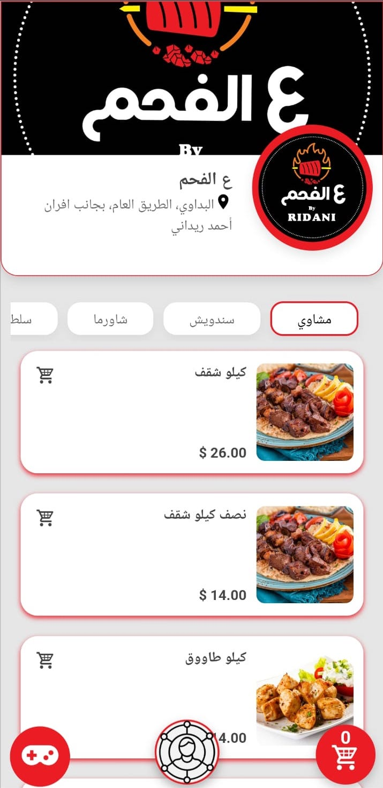
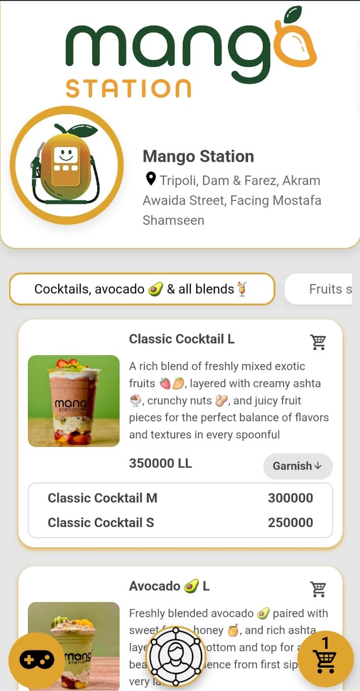
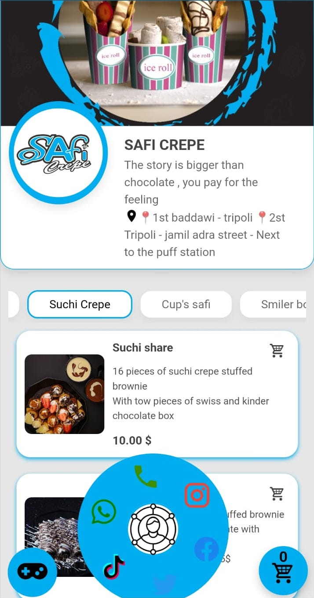
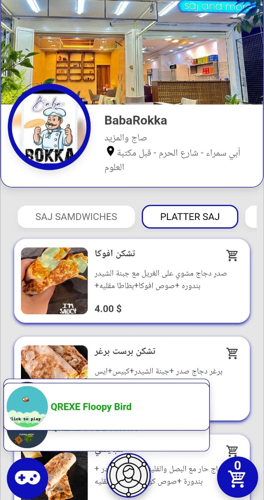

# QrMenu Project

## 📖 About

**QrMenu** is a Laravel-based digital menu platform designed for restaurants, cafes, and stores. It provides a clean, fast, and interactive way for businesses to display their product offerings — whether food, goods, or various other categories.  

Customers can browse menus with multiple product sizes, components, and pricing options. Orders can be quickly placed via **WhatsApp** directly from the menu. Additionally, each store can showcase their social media links, and there's even a dedicated section where customers can enjoy exciting in-menu games while waiting for their orders.

---

## 🚀 Features

- 📱 Fully responsive digital menu system.
- 📦 Product listing with support for multiple sizes, ingredients, and prices.
- 🛒 Easy order placement via **WhatsApp** integration.
- 📱 Social media links display for each store.
- 🎮 Interactive games section for customers while waiting for orders.
- 📊 Admin dashboard built with **Laravel Nova** for full control over products, categories, and orders.

---

## 🛠️ Technologies Used

- **Backend:** Laravel  
- **Frontend:** Pure JavaScript  
- **Admin Panel:** Laravel Nova  
- **Database:** MySQL  

---

## 📸 Screenshots

  <table>
    <tr>
      <td>
        
      </td>
      <td>
        
      </td>
    </tr>
    <tr>
      <td>
        
      </td>
      <td>
        
      </td>
    </tr>
    <tr>
      <td>
        
      </td>
      <td>
        
      </td>
    </tr>
  </table>

---

## 📬 Contact

For more information or inquiries, feel free to reach out via [LinkedIn](https://www.linkedin.com/in/abdulrahman-derbass-aaa3021b3?utm_source=share&utm_campaign=share_via&utm_content=profile&utm_medium=android_app) or [email](mailto:abdulrahmanderbass@gmail.com).

